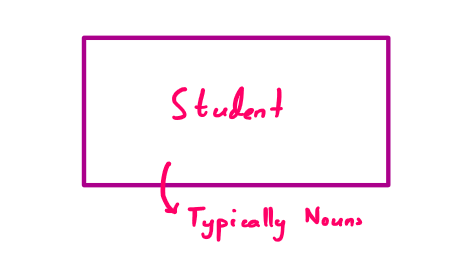
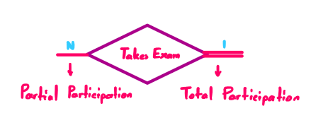
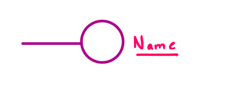
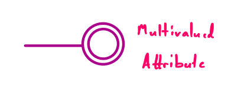

Databases
+++++++++

Entity Relationship Diagrams
============================
Entity Relationship Diagrams are graphical representations of the entities and their relationships in a database. They are used to provide flexible data-structuring and present a logical structure of the entire database. Hence, they are considered **conceptual models**. In this section, we will discuss the components of an ERD and how they are represented.

They consist of three main units:

* `Entity Sets <#entity-sets>`_
* `Relationship Sets <#relationship-sets>`_
* `Attributes <#attributes>`_

Entity Sets: 
------------

Represented by rectangles. Each entity set is a collection of similar entities.

**Note:** Entities are typically nouns.

**Examples:** Student, Course, Department, etc.

|

Relationship Sets:
------------------

Represented by diamonds. Each relationship set is a collection of similar relationships.

**Note:** Typically verbs

**Examples:** IsEnrolled, TakesExam, Publishes etc.

Relationship Sets have Cardinality constraints:

* One-to-One
   * **Example:** "each person has exactly one NHS number"
* Many-to-One
   * **Example:** "a studio may produce multiple films"
* Many-to-Many
   * **Example:** "an actor may star in many films and a film may have many actors"

They also have Participation constraints:

* Total participation
   * "each student must be enrolled in at least one course" 
* Partial participation
   * "a customer does not need to take a loan to be registered with a bank"

Attributes:
-----------

Represented by ellipses. Each attribute is a property of an entity or a relationship set.

**Note:** Attributes are typically adjectives.

|

**Note:** Underlined attributes are primary keys.

|

|

**Note:** Attributes can be hold multiple values.

|

 
|

**Note:** Attributes can be computed from other attributes, these are not stored as they may change on subsequent fetches.

|

Relational Models
==================

Relations are represented as tables. Each row in a table represents a relationship among a set of values. Each table is a relation. Each column in a table represents an attribute of the relation.

 